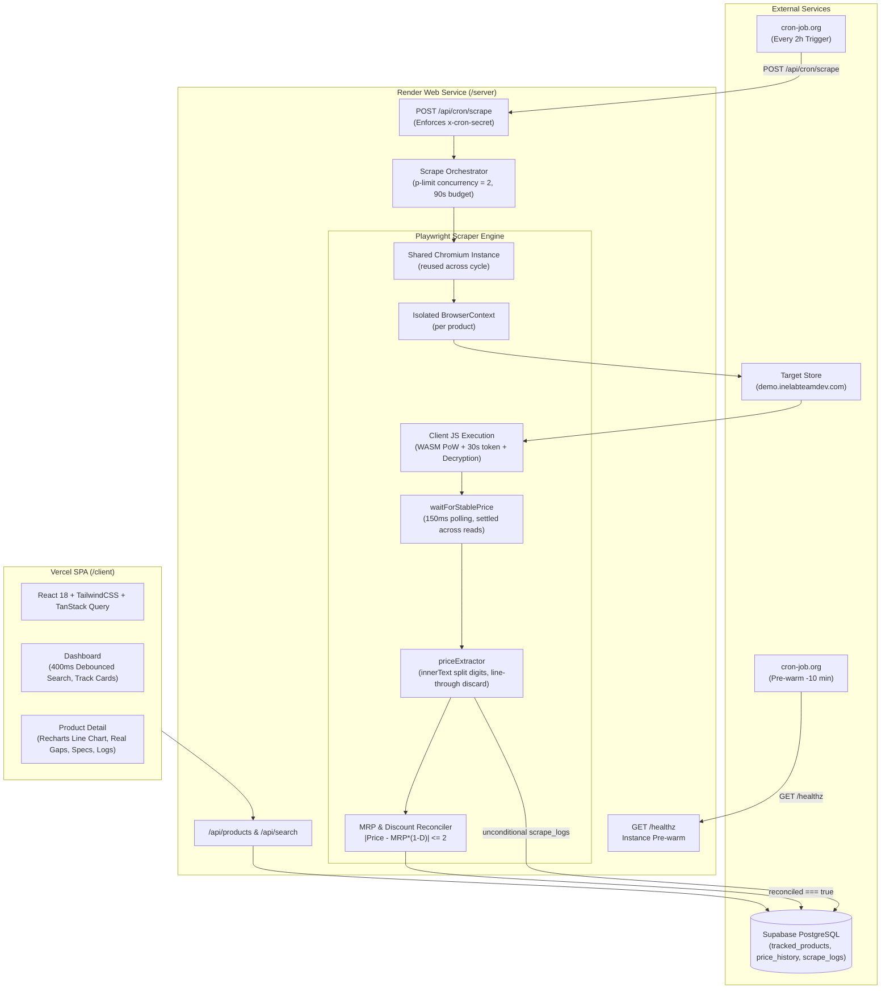

# Autonomous E-Commerce Price & Stock Tracker

A production-grade price tracking monorepo designed to bypass advanced client-side anti-scraping defenses (WASM Proof-of-Work, encrypted price payloads, rotating obfuscated classes, and visual DOM digit splitting) on `https://demo.inelabteamdev.com`.

---

## System Architecture



### Scraping Pipeline & Defensive Rules
1. **Autonomous Client JS Execution**: Chromium loads the target page, executing the site's dynamic challenge (WASM Proof-of-Work via `/api/challenge`), acquiring the 30-second session token (`POST /api/session`), and decrypting the price payload in-memory.
2. **Visual Order Assembly (`innerText`)**: Scrambled DOM nodes (`"priceCarrier": "split"`) are resolved into visually correct numbers using `locator.innerText()` rather than raw `textContent`.
3. **Decoy Rejection**: Struck-through prices (decoy deal prices and original MRP) are detected via computed CSS styles (`text-decoration: line-through`) and discarded.
4. **Strict MRP Reconciliation**: A record is inserted into `price_history` **ONLY** when `price > 0` and `|price - (MRP * (1 - discount/100))| <= 2`. Unverified, zero, null, or carried-forward prices are strictly rejected and logged to `scrape_logs` only.

---

## Environment Variables

### `/server` (`server/.env`)

| Variable | Required | Default | Description |
|---|---|---|---|
| `PORT` | No | `3000` | HTTP port for the Express application |
| `SUPABASE_URL` | Yes | — | Supabase project URL (`https://<id>.supabase.co`) |
| `SUPABASE_SERVICE_ROLE_KEY` | Yes | — | Supabase service role secret (full DB bypass access) |
| `STORE_BASE_URL` | No | `https://demo.inelabteamdev.com` | Base URL of the monitored target store |
| `CRON_SECRET` | Yes | `default-cron-secret` | Shared secret token required in `x-cron-secret` header |
| `SCRAPE_CONCURRENCY` | No | `2` | Concurrency limit managed by `p-limit` |
| `SCRAPE_MAX_ATTEMPTS` | No | `3` | Maximum retry attempts per product page load |
| `NAV_TIMEOUT_MS` | No | `15000` | Navigation timeout per attempt in milliseconds |
| `CYCLE_BUDGET_MS` | No | `90000` | Maximum global time budget for an entire scrape cycle |
| `CLIENT_ORIGIN` | No | `http://localhost:5173` | Allowed CORS origin for frontend requests |
| `HEADED` | No | `false` | When `true`, launches a visible Chromium browser window |

### `/client` (`client/.env`)

| Variable | Required | Default | Description |
|---|---|---|---|
| `VITE_API_BASE_URL` | Yes | `http://localhost:3000` | Base URL of the backend Express server |

---

## Database Setup (Supabase)

1. Navigate to your [Supabase Dashboard](https://supabase.com/dashboard) and open the **SQL Editor**.
2. Copy and execute the contents of [supabase/schema.sql](supabase/schema.sql).
3. This creates exactly three tables with foreign key cascades and performance indexes:
   - `tracked_products`
   - `price_history` (with `check (price > 0)` and composite index `(product_id, scraped_at desc)`)
   - `scrape_logs` (with outcome enum constraint and composite index `(product_id, created_at desc)`)

---

## Local Development Setup

### Prerequisites
- Node.js >= 20.0.0
- npm >= 10.0.0

### 1. Server Setup (`/server`)

```bash
# Navigate to server directory
cd server

# Install dependencies and Playwright Chromium browser
npm install
npx playwright install chromium

# Configure environment
cp .env.example .env
# Edit .env and supply your SUPABASE_URL and SUPABASE_SERVICE_ROLE_KEY

# Start server in development mode
npm run dev
```
The server will start listening on `http://localhost:3000`.

### 2. Client Setup (`/client`)

```bash
# Navigate to client directory
cd client

# Install dependencies
npm install

# Configure environment
cp .env.example .env

# Start client in development mode
npm run dev
```
The client application will open on `http://localhost:5173`.

---

## Automated Tests

Run the comprehensive test suite verifying price reconciliation math, stock normalization, exponential backoff, obfuscated DOM extraction, and API security:

```bash
# Run all server tests (43 unit & integration tests)
cd server
npm run test
```

---

## Headed Demo Scripts

To visually observe Chromium executing the Proof-of-Work, decrypting the DOM, and parsing prices in real time, run the headed CLI monitor:

```bash
cd server

# 1. Standard Headed Scrape:
# Launches visible Chromium browser with live terminal telemetry
npm run scrape:headed

# 2. Target Specific Product:
node scripts/headedRun.js --productId <uuid>

# 3. Simulate Slow Price Decryption:
# Intercepts /api/products/:id/price and delays response by 5s
# Demonstrates 150ms stability polling and recovery on camera
npm run scrape:headed:slow

# 4. Simulate Session Network Failure:
# Aborts first /api/session call to trigger autonomous whole-page retry
# Demonstrates exponential backoff + jitter in action
npm run scrape:headed:error
```

---

## cron-job.org Configuration

To manage periodic scraping within Render's free-tier spin-down constraints:

### Job 1: Instance Pre-Warm (Every 2 Hours, -10 Minutes)
Render free-tier web services spin down after 15 minutes of inactivity. A lightweight pre-warm ping prevents the cold-start delay from eating into the scrape cycle budget.

- **Title**: `Price Tracker Pre-warm Ping`
- **URL**: `https://<your-render-url>/healthz`
- **Request Method**: `GET`
- **Schedule**: User-defined cron expression: `50 1,3,5,7,9,11,13,15,17,19,21,23 * * *` (10 minutes before every 2 hours)
- **Timeout**: `30s`

### Job 2: Main Scrape Cycle (Every 2 Hours)
- **Title**: `Price Tracker Autonomous Scrape Cycle`
- **URL**: `https://<your-render-url>/api/cron/scrape`
- **Request Method**: `POST`
- **Schedule**: User-defined cron expression: `0 */2 * * *` (At minute 0 past every 2nd hour)
- **Headers**:
  ```http
  x-cron-secret: <YOUR_CRON_SECRET>
  Content-Type: application/json
  ```
- **Timeout**: `120s` (sufficient for the ~90s global cycle budget)
